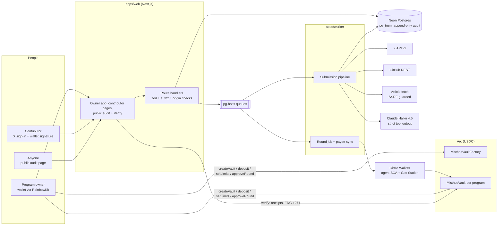

# Architecture

## Components

| Component            | Responsibility                                                                                                                                                                                     |
| -------------------- | -------------------------------------------------------------------------------------------------------------------------------------------------------------------------------------------------- |
| `packages/contracts` | `MisthosVault` (EIP-1167 clones): roles, limits, payee cooldown, rounds, `paid[payoutId]`. `MisthosVaultFactory`: deterministic clones per (owner, programId).                                     |
| `packages/shared`    | Chain constants with doc citations, zod schemas, canonical JSON + keccak, id derivations, EOA/ERC-1271 signature checks, decision-record verification.                                             |
| `packages/agent`     | Pure logic used by the worker: URL classification, fetchers, deterministic checks, judge, decision engine, explanations, records + signer interface, round planner, round job, executor interface. |
| `packages/db`        | Drizzle schema and checked-in migrations; triggers make `audit_events` append-only.                                                                                                                |
| `apps/web`           | Owner and contributor UI, public audit and verification, APIs. Never holds a signing key.                                                                                                          |
| `apps/worker`        | Consumes queues; owns the agent signer and executor (Circle SCA, EOA fallback).                                                                                                                    |

## Submission flow

1. Contributor submits a link. The web app validates it (type, membership, verified wallet, round open, duplicates,
   daily limit), stores it, and enqueues `submission-process`.
2. The worker claims it atomically (lease for crashed workers), fetches the one resource (cached; for an X post, also
   the author's own self-reply thread via one capped search), and runs the deterministic checks against earlier
   submissions in the program.
3. If no rejecting flag already decides, Claude scores it via the `record_judgment` tool (`judge-v5`).
4. The decision engine (`rules-v8`) picks the action and amount (points always from the criterion scores; 0 when the
   judge recommends rejecting); the explanation is written from facts.
5. The record is canonicalized, hashed and signed; decision, status and audit event commit in one transaction.
6. Retryable upstream errors go back to the queue with backoff; the last attempt escalates instead of failing.
7. A decided item not yet in a payout can be re-processed (`reprocess`): fresh fetch, current rules, and a new signed
   record that supersedes the old one, audited on both sides. Once an item is in a planned round, neither a
   re-process nor a reviewer override can change it; stopping it takes the owner's on-chain controls.

## Round flow

1. A round closes on schedule or when the owner clicks _Close round now_.
2. Every approved item is fetched again: deleted or no-longer-owned work is rejected with a signed record.
3. Each contributor's current wallet is registered as payee (the vault starts its cooldown).
4. `planRound` aggregates whole items per contributor within `maxPerPayout`, `maxPerRound` and the remaining daily
   cap, skipping payees in cooldown; anything left carries to the next round with a reason.
5. `proposeRound` commits the payouts and the decision root. At or below the approval threshold the agent executes;
   above it, the owner signs `approveRound` and the agent then executes.
6. Every step reads chain and database state first and uses deterministic Circle idempotency keys, so retries and
   crashes resume without double-sending.

## Identifiers

| Value                 | Derivation                                                                   |
| --------------------- | ---------------------------------------------------------------------------- |
| `programId`           | `keccak256("misthos:program:" + uuid)`                                       |
| `roundId`             | `keccak256("misthos:round:" + uuid)`                                         |
| `contributorId`       | `keccak256("misthos:contributor:" + uuid)`                                   |
| `payoutId`            | `keccak256(abi.encode(programId, roundId, contributorId))`                   |
| payout `decisionHash` | `keccak256(sorted decision hashes of its items, concatenated)`               |
| `roundDecisionRoot`   | `keccak256(sorted decision hashes of every item in the round, concatenated)` |
| `decisionHash`        | `keccak256(canonical JSON of the decision record)`                           |

## Hosting

Vercel (web), Railway (worker), Neon (Postgres). The worker uses Neon's direct endpoint for pg-boss; the web app
only sends jobs.

The worker doesn't poll. It works the queues in short drains and closes its database connections in between, so
Neon can scale to zero:

- **Wake:** after enqueueing a job, the web app calls the worker's `POST /wake` (shared secret
  `WORKER_WAKE_SECRET`, timing-safe compare). The worker drains at once. Best effort: a missed wake is picked up by
  the next tick.
- **Tick:** every `WORKER_TICK_MINUTES` (15) a drain closes due rounds, re-enqueues unfinished rounds (crashed runs,
  rounds waiting for the owner's on-chain approval) and stuck submissions, and runs pg-boss maintenance.
- **Retries:** a drain reports when the next backed-off retry is due; the worker sets a timer for it.
- **Health:** `GET /health` on the worker answers from memory (last tick, last drain, errors).
  `/api/health/worker` on the web app relays it, so monitoring never touches the database. `/api/health` is static.

Payout safety doesn't depend on timing: every round run reads the chain and the database first, and every agent
transaction has a deterministic Circle idempotency key.
